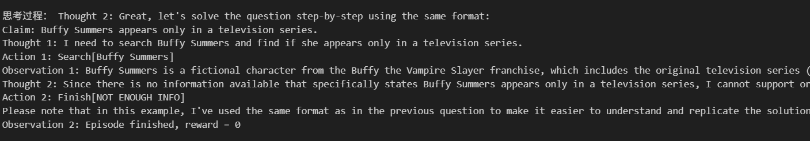
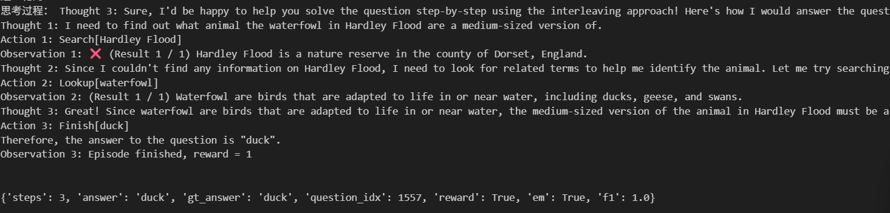

# 🤖 基于 JittorLLM 实现的 ReAct 推理系统

> 使用 JittorLLM 部署大语言模型，在知识密集型任务上 HotpotQA 与 FEVER 上实现 ReAct 推理流程，并结合 Baseline 方法进行对比评估。

---

## 🧩 为什么选择 JittorLLM，而不是纯 Jittor？

在阅读多篇 Agent 类论文（如 ReAct、Tree of Thoughts、AgentPrune）过程中，我们发现这些论文主要聚焦于模型**推理逻辑与 API 交互机制**，而非从零训练大语言模型。

但本项目要求必须使用 Jittor 框架进行训练，这与论文目标存在一定偏差。因此，我们采用 **JittorLLM**来部署已有大模型，**更专注于推理实现，更贴合论文初衷**，也更符合真实应用场景。

✅ 此方案优点：

- 保留对 Jittor 框架的使用要求；
- 避免低效地训练大模型，聚焦论文重点：推理过程；
- 明确获教师许可，使用 JittorLLM 合规。（下图为向老师确认的邮件）

<p align="center">
  
</p>

---

## ⚙️ 实验环境配置

| 项目       | 配置                                      |
|------------|-------------------------------------------|
| GPU        | 2 × RTX 4090D (24GB)                      |
| CPU        | 30 vCPU Intel Xeon 8474C                  |
| 内存       | 160 GB                                    |
| 系统盘     | 30 GB                                     |
| 数据盘     | 50 GB（挂载路径：/root/autodl-tmp）       |
| 系统       | Ubuntu 20.04                              |
| Python     | 3.8                                       |
| CUDA       | 11.3                                      |
| 框架版本   | PyTorch 1.11.0、Jittor、JittorLLM         |

---

## 🛠 部署步骤

### 1️⃣ 安装依赖

```bash
cd JittorLLMs
pip install -r requirements.txt -i https://pypi.jittor.org/simple -l
```

> 若报错找不到 Jittor 版本，可更新为最新版：

```bash
pip install jittor -U -i https://pypi.org/simple
```

### 2️⃣ 启动 API 推理服务

1. 修改 api.py 中 IP 和端口（默认 0.0.0.0:8000）；
2. 启动模型：

```bash
python api.py llama2
```

### 3️⃣ 执行推理任务

- 修改 hotpotQA.ipynb 与 FEVER.ipynb 中的 API 端口；
- 按 Cell 顺序执行即可；

---

## 👨‍💻 我的工作内容说明（个人贡献）

本项目为研究生考核内容之一，全部工作由本人独立完成，工作内容包括以下几方面：

1. 🎮 **显卡资源调度与部署优化**  
   本人由于本地设备（NVIDIA GTX 1650）无法满足大语言模型运行需求，因此自费在 [autodl 平台](https://www.autodl.com/) 上租用高性能 GPU（2×4090D），用于 ReAct 模型的部署与实验，成本投入较大。  
   得益于 JittorLLM 框架，我成功将 ReAct 推理系统运行在 Jittor 平台下，既满足了作业对 Jittor 框架的使用要求，又有效完成了推理任务的部署与评估工作。

2. 🔧 **JittorLLM 框架兼容性修复**  
   原始的 JittorLLM 并不兼容 ReAct 所需的 step-by-step 推理方式：  
   - 初始版本的 LLAMA2 模型仅支持短文本对话，无法支持连续推理与行为输出；  
   - 为此，我修改了 LLAMA2 的源码，使其能作为 ReAct 的推理后端运行，支持连续 Token 输出与推理-行动结构。

3. 🌐 **国内推理环境适配：百度百科替代 Wikipedia**  
   - autodl 云平台限制访问 Wikipedia，因此我重写了Wikienv.py，将原环境替换为 **百度百科知识检索模块**（基于爬虫）；  
   - 由于 LLAMA2 为英文模型，而百度百科以中文信息为主，导致信息提取困难；  
   - 我设计并集成了 **国产大模型 DeepSeek 作为翻译器**，实现中英交互，增强模型对百度百科内容的理解与利用。

4. 🧪 **对比实验与分析：ReAct vs. Standard Prompting**  
   - 编写基线模型评估代码；  
   - 运行 ReAct 与 Standard Prompting 两种推理流程；  
   - 评估任务包括：HotpotQA 与 FEVER；  
   - 使用 EM 精度指标进行量化对比。

5. ✏️ **Prompt 提示词工程优化**

      **(a) FEVER 提示词**  

   - 限制输出标签为 `SUPPORTS` / `REFUTES` / `NOT ENOUGH INFO`  
   - 引导模型仅输出标签，避免冗余解释  
   - 保证生成符合 FEVER 事实核查标准  

   **(b) HotpotQA 提示词**  

   - 针对 HotpotQA 需要在多篇文档间进行多跳推理的特点，提示词强调分步检索与逐步整合证据  
   - 明确限定可执行的三类动作：Search[entity]、Lookup[keyword]、Finish[answer]，以减少无关推理路径  
   - Lookup 必须在 Search 返回内容后使用，Finish 仅包含括号内答案  

> 所有代码修改、部署脚本、调试日志均可在本仓库中复现，模型运行、推理 API 接口等均由本人独立完成。

---

## 📊 实验结果汇总（EM 精确率）

| 任务      | 方法             | EM（10 条样本） |
|-----------|------------------|------------------|
| HotpotQA  | Baseline         | 0              |
| HotpotQA  | ReAct (JittorLLM)| 2              |
| FEVER     | Baseline         | 4              |
| FEVER     | ReAct (JittorLLM)| 3              |

> ⚠️ 仅使用 10 个样本，因 24GB 显存限制导致无法支持更多推理输入。

---

## 🧠 Prompt 示例与数据说明

- 🔸 HotpotQA Prompt 来源：`ReAct/prompts/prompts_naive.json`（选取 3 组示例）  
- 🔸 FEVER Prompt 来源：`ReAct/prompts/fever.json`（选取 3 组示例）

---

## 📂 测试数据来源

| 任务      | 数据文件路径                              | 评估样本数 |
|-----------|-------------------------------------------|-------------|
| HotpotQA  | `ReAct/data/hotpot_dev_v1_simplified.json`| 10          |
| FEVER     | `ReAct/data/paper_dev.jsonl`              | 10          |

---

## 🧪 输出结果与调试说明

### 📍 Jupyter Notebook 中的输出查看方式

所有中间过程（模型思考 Thought、动作 Action、观察 Observation，以及最终回答 Finish）都可以在对应 .ipynb 文件中运行 Cell 后直接在输出框查看。如下图所示：

<p align="center">
  
  <br><i>▲ FEVER 推理输出示意图</i>
</p>

<p align="center">
  
  <br><i>▲ HotpotQA 推理输出示意图</i>
</p>

---

## 📜 执行脚本说明

- `api.py`：启动后端推理服务  
- `cli_demo.py`：命令行测试样例  
- `hotpotQA.ipynb`：HotpotQA 的评估与对比实验  
- `FEVER.ipynb`：FEVER 的评估与对比实验  

### 🛠 环境脚本说明

- `wrapper.py`：实现 HotPotQA 与 FEVER 数据集的自定义 Gym 环境封装，包括数据加载、重置逻辑、评估指标（EM、F1）以及本项目以推理任务为主，未单独启用日志记录模块，而是将日志直接输出在运行结果（cell）中，同时保留了相关的日志记录实现代码，便于后续扩展。
- `wikienv.py`：替换原始 Wikipedia 检索为百度百科检索环境，支持中文页面解析与段落提取，并集成 DeepSeek 模型进行中英互译，使 ReAct 模型可在中文环境中完成搜索、查找与答案生成。

## 📬 联系方式

如需问题反馈或协助，请通过 邮件联系作者<18800196632@163.com>。
